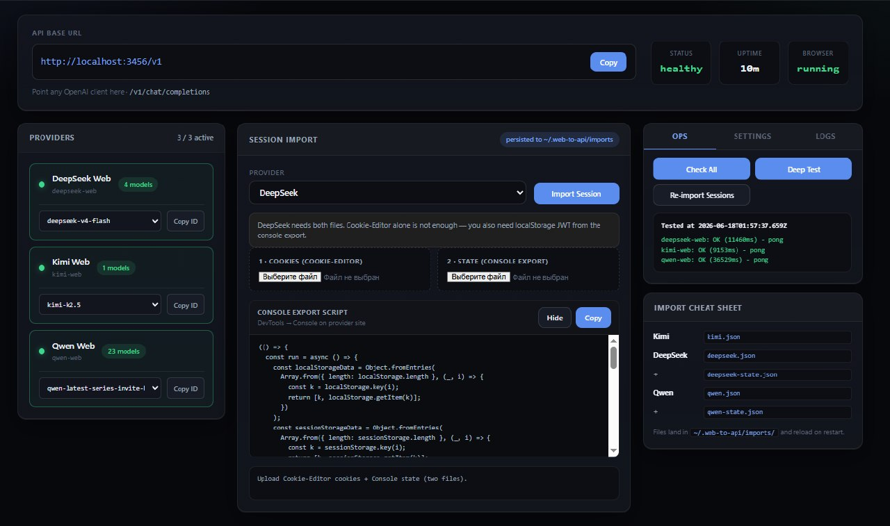

# web-to-api

Turn free web AI chat sessions into a **local OpenAI-compatible API**.

Use DeepSeek, Kimi, and Qwen through their browser interfaces — no official API keys required. Any tool that speaks the OpenAI Chat Completions API (Cursor, Open WebUI, custom scripts) can connect to `http://127.0.0.1:3456/v1`.

**Most people never touch the CLI after install** — everything runs through the built-in **Web Dashboard** at `http://127.0.0.1:3456`.



## Start here (Web UI)

1. **Install & start** (one time):

   ```bash
   git clone https://github.com/PruhaNLP/web-to-api.git
   cd web-to-api
   npm install
   npm run build
   npm run dev -- --browser-mode launch --port 3456
   ```

   Your browser should open the dashboard. If not, go to **http://127.0.0.1:3456** manually.

2. **Copy the API URL** — top bar shows `http://127.0.0.1:3456/v1`. Click **Copy** and paste it into Cursor, Open WebUI, or any OpenAI client. API key can be anything (e.g. `local`).

3. **Import your login** — middle panel **Session Import**:
   - Pick a provider (DeepSeek / Kimi / Qwen).
   - On the provider site in your normal browser: DevTools → Console → run the **Console Export** script (Show → Copy in the dashboard).
   - Upload the exported files (cookies + state where needed).
   - Click **Import Session** — saved to `~/.web-to-api/imports/` and applied immediately.

4. **Check it works** — right panel **Ops** tab → **Check All** or **Deep Test**. Green = ready.

5. **Connect your app** — use model `auto` (tries providers in order) or copy a model ID from the provider cards (dropdown + **Copy ID**).

That’s it. No curl, no manual file paths unless you prefer them.

### Dashboard tabs

| Tab | What it’s for |
|-----|----------------|
| **Ops** | Health checks, smoke tests, re-import sessions, Telegram test alert |
| **Settings** | Auto model order, Telegram error alerts (proxy + bot token + chat ID) |
| **Logs** | Live `server.log` — auto-refreshes and scrolls to newest lines |

### When you need the command line

- **Headless VPS** (no browser on the server): copy JSON files into `~/.web-to-api/imports/` and restart — see [Provider session requirements](#provider-session-requirements).
- **Proxy** (blocked sites): add `--proxy-server`, `--proxy-user`, `--proxy-pass` to the start command — same proxy you use in a browser.
- **Don’t open browser on start**: `--no-open` and open the dashboard URL yourself.

## How it works

```text
Your client (OpenAI SDK, Cursor, curl, …)
  → http://127.0.0.1:3456/v1
  → web-to-api
  → Playwright Chromium (saved login session)
  → chat.deepseek.com / kimi.com / chat.qwen.ai
```

The server reuses your browser cookies and session state. It does not store vendor API keys.

## Features

- **Web dashboard** — visual setup: session import, health, ops, settings, logs (no CLI required for day-to-day use)
- **OpenAI-compatible API** — `GET /v1/models`, `POST /v1/chat/completions` (stream + non-stream)
- **Three providers** — DeepSeek (4 models), Kimi, Qwen
- **`auto` model** — tries models in order until one succeeds
- **Pseudo tool calls** — prompt-based tool calling for clients that expect OpenAI `tool_calls`
- **Structured output** — `response_format` via prompt + JSON parse
- **Headless-friendly** — launch mode, HTTP proxy, systemd install

## Web dashboard (details)

The dashboard is the main interface. After `npm run dev`, open **http://127.0.0.1:3456**.

**Top bar** — API base URL with one-click copy, server health, uptime, browser status.

**Providers (left)** — see which sites are logged in, pick a model from the dropdown, **Copy ID** for your client config.

**Session Import (center)** — upload cookies/state per provider. The built-in **Console Export** script collects everything from DevTools; files land in `~/.web-to-api/imports/` and reload on restart.

**Right panel**
- **Ops** — Check All, Deep Test, Re-import Sessions, Telegram test
- **Settings** — auto model fallback order, Telegram alerts (HTTP proxy if `api.telegram.org` is blocked)
- **Logs** — tail of `~/.web-to-api/logs/server.log`

**Interactive login** — if you have a display (desktop or Xvfb), you can log in through Chrome from the provider cards instead of importing files. On a headless VPS, use Session Import only.

## Quick start (CLI reference)

### Requirements

- Node.js 20+
- Google Chrome or Chromium

### Install & run

Same as [Start here](#start-here-web-ui). Minimal one-liner after clone:

```bash
npm install && npm run build && npm run dev -- --browser-mode launch --port 3456
```

### Display & headless (Linux)

Chromium runs **headed** (window) when `DISPLAY` is set, **headless** when it is not. There is no single correct value — it depends on your machine.

| Setup | What to do |
|-------|------------|
| **Desktop** (monitor connected) | Run as above. `DISPLAY` is usually already set (e.g. `:0` or `:1`). Dashboard → Login works. |
| **VPS / SSH, no GUI** | **Recommended:** export session JSON into `~/.web-to-api/imports/` — API works without any display. |
| **VPS but you need a visible browser** (login, debugging) | Start a **virtual display** (Xvfb), then export `DISPLAY` to it. |

**Virtual display example** (headless server, when you need headed Chrome):

```bash
# once: sudo apt install xvfb   (or xvfb-run on some distros)

Xvfb :99 -screen 0 1920x1080x24 &
export DISPLAY=:99   # any free number (:99, :100, …) — not mandatory

npm run dev -- --browser-mode launch --port 3456 --no-open
```

Use `echo $DISPLAY` on your desktop to see what you already have — do not copy `:99` unless you started Xvfb on that number.

**Without `DISPLAY`:** launch mode still works; Playwright uses headless Chromium. That is enough if sessions come from import files. Interactive Dashboard login is awkward without a real or virtual display — prefer **Session Import** on servers.

On a **headless server**, do **not** rely on Dashboard → Login unless you run Xvfb (or similar). Use **session file import** (see below).

Verify:

```bash
curl http://127.0.0.1:3456/admin/health
curl http://127.0.0.1:3456/v1/models
curl http://127.0.0.1:3456/admin/imports   # import folder + provider specs
```

### Smoke test

```bash
curl http://127.0.0.1:3456/v1/chat/completions \
  -H "Content-Type: application/json" \
  -d '{
    "model": "auto",
    "messages": [{"role": "user", "content": "Reply with one word: ok"}],
    "stream": false
  }'
```

## Client configuration

Point any OpenAI-compatible client at:

```text
Base URL:  http://127.0.0.1:3456/v1
API key:   any string (ignored unless --auth-token is set)
```

Use **`/v1/chat/completions`**, not `/v1/responses`.

Example with the OpenAI Node SDK:

```typescript
import OpenAI from 'openai';

const client = new OpenAI({
  baseURL: 'http://127.0.0.1:3456/v1',
  apiKey: 'local',
});

const res = await client.chat.completions.create({
  model: 'auto',
  messages: [{ role: 'user', content: 'Hello!' }],
});
console.log(res.choices[0].message.content);
```

## Models

| Model ID | Provider |
|----------|----------|
| `auto` | Fallback chain (recommended) |
| `deepseek-web/deepseek-v4-flash` | DeepSeek |
| `deepseek-web/deepseek-v4-flash-reasoner` | DeepSeek |
| `deepseek-web/deepseek-v4-pro` | DeepSeek |
| `deepseek-web/deepseek-v4-pro-reasoner` | DeepSeek |
| `kimi-web/kimi-k2.5` | Kimi |
| `qwen-web/qwen3.7-plus` | Qwen |
| `qwen-web/qwen3.7-max` | Qwen |
| `qwen-web/qwen3.6-plus` | Qwen |

## CLI options

```bash
web-to-api [options]

  -p, --port <port>              Listen port (default: 3456)
  --host <host>                  Bind address (default: 127.0.0.1)
  --auth-token <token>           Require Bearer token for /v1 and /admin
  --browser-mode <mode>          attach | launch (default: attach; use launch on headless)
  --chrome-profile <dir>         Chrome user data directory
  --proxy-server <url>           HTTP proxy for browser traffic
  --proxy-user / --proxy-pass    Proxy credentials
  --state-dir <dir>              Data directory (default: ~/.web-to-api)
  --no-open                      Skip opening dashboard
```

## Data layout

Runtime files never live in the project root.

```text
~/.web-to-api/                 # WTA_STATE_DIR — runtime data
  auth.json                    # provider auth flags
  settings.json                # auto model order, Telegram alerts, etc.
  logs/
  imports/                     # drop session JSON here
    deepseek.json
    kimi.json
    qwen.json

~/web-to-api/
  chrome-profile/              # persistent login when you have a display
```

On startup the server auto-imports any files found in `imports/`.

## Provider session requirements

| Provider | Headless (no VNC) | Import file | What must be in the export |
|----------|-------------------|-------------|----------------------------|
| **DeepSeek** | ✅ import or profile | `deepseek.json` | Cookies **+** localStorage JWT (`userToken` / `settingsJwt`). Cookie-only often fails |
| **Kimi** | ✅ import | `kimi.json` | Cookie `kimi-auth` (Bearer token). Cookie array is enough |
| **Qwen** | ✅ import | `qwen.json` | Cookies + localStorage (Playwright `storageState` best). No VNC if export is complete |

**Headless workflow (proven):**

1. On any machine with a browser, export session (Cookie Editor array, or Playwright `storageState`).
2. Copy to `~/.web-to-api/imports/qwen.json` (and `kimi.json`, `deepseek.json`).
3. Start server — auto-import on boot — or run `npm run cookies:refresh`.
4. Smoke: `curl …/v1/chat/completions` with `"model": "qwen-web/qwen3.7-plus"`.

**With a display** (local PC): you can also log in via Dashboard → Login or use a persistent Chrome profile at `~/web-to-api/chrome-profile/`.

Supported import formats:

- Cookie Editor array: `[{ "name": "...", "value": "...", "domain": "..." }]`
- Custom object: `{ "origin": "...", "cookies": "...", "localStorage": { ... } }`
- Playwright `storageState`: `{ "cookies": [...], "origins": [...] }`

API: `GET /admin/imports` returns the full spec for each provider.

## Cookie / session refresh

```bash
# 1. Put files in ~/.web-to-api/imports/
# 2. Either restart the server (auto-import) or:
npm run cookies:refresh
npm run cookies:refresh -- --status
```

Or use dashboard **Session Import** or **Ops → Re-import Sessions** (applies immediately and saves to `imports/`).

## Environment variables

| Variable | Description |
|----------|-------------|
| `WTA_PORT` | Listen port |
| `WTA_HOST` | Bind address |
| `WTA_AUTH_TOKEN` | API bearer token |
| `WTA_STATE_DIR` | Runtime data directory (default `~/.web-to-api`) |
| `WTA_IMPORTS_DIR` | Session import folder (default `$WTA_STATE_DIR/imports`) |
| `WTA_PROXY_SERVER` | Browser HTTP proxy |
| `WTA_PROXY_USER` / `WTA_PROXY_PASS` | Proxy auth |
| `WTA_TELEGRAM_BOT_TOKEN` | Error alerts (optional; also configurable in Settings tab) |
| `WTA_TELEGRAM_CHAT_ID` | Telegram chat ID |
| `WTA_TELEGRAM_PROXY_SERVER` | HTTP proxy for Telegram Bot API (Settings tab) |
| `WTA_TELEGRAM_PROXY_USER` / `WTA_TELEGRAM_PROXY_PASS` | Telegram proxy auth |
| `DISPLAY` | X11 display for headed Chromium (`:0` desktop, `:99` Xvfb, etc.) |

## Admin API

Management endpoints — all available in the dashboard; use these only if you automate outside the Web UI:

| Endpoint | Description |
|----------|-------------|
| `GET /admin/health` | Server & provider health |
| `GET /admin/providers` | Provider list & auth status |
| `POST /admin/auth/login` | Start browser login flow |
| `POST /admin/auth/import-state` | Import cookies / storage state |
| `GET /admin/imports` | Import folder path + provider session specs |

## Development

```bash
npm run typecheck
npm run test:unit
npm run dev
```

## Security

- Binds to `127.0.0.1` by default — do not expose publicly without `--auth-token`.
- Session cookies live in the Chromium profile and state directory. Do not commit them.
- Use a dedicated browser profile, not your daily driver.

## Known limitations & risks

This project automates free web chat UIs. That works, but it comes with real trade-offs. Read this before relying on it in production.

### Terms of service & account risk

- You are using **unofficial** access paths, not vendor APIs.
- DeepSeek, Kimi, and Qwen may change their web UI, block automation, rate-limit, or **suspend accounts** if they detect non-browser usage patterns.
- High request volume, headless browsers, datacenter IPs, or shared proxies increase that risk.
- **This is not a substitute for a paid API** if you need stability, SLA, or compliance.

### Reliability

- Web endpoints change without notice. A provider can break overnight until the adapter is updated.
- **`auto` fallback** helps, but if all models fail you still get errors — there is no guaranteed uptime.
- Qwen uses DOM automation (typing into the page). It is slower and more fragile than direct API calls.
- Sessions expire. Cookies go stale; you may need to re-login or re-import state files.
- Reasoning / tool-call output is **pseudo** — parsed from model text, not native vendor function calling. Complex agents may mis-parse JSON.

### Security & privacy

- **Session cookies = full account access.** Anyone with your state dir, Chrome profile, or an open API port can use your logged-in sessions.
- Default bind is localhost, but `--host 0.0.0.0` without `--auth-token` exposes your sessions to the network.
- The dashboard and `/admin/*` routes can import cookies and trigger logins. Protect them the same way as the API.
- Do **not** commit `*-state.json`, `deepseek.json`, `kimi.json`, `qwen.json`, or Chrome profile directories. They contain live session material.
- Proxy credentials in env vars or systemd units must stay off public repos and shared logs.

### Operational issues

- **Headless + proxy** setups are harder to debug than local Chrome with a visible window. On a VPS without GUI, use session import; use Xvfb only if you need headed login/debug.
- Snap Chromium on Linux cannot use profiles inside dot-folders in `$HOME`; use `~/web-to-api/chrome-profile` or similar.
- One Chromium profile per instance. Running multiple servers on the same profile can corrupt locks or sessions.
- Long conversations are collapsed into one web prompt. Very large histories may truncate, slow down, or confuse the model.
- Streaming is emulated for some paths (`auto`, pseudo tools): the server may wait for a full response before emitting SSE chunks.

### Client compatibility

- Implements **`/v1/chat/completions` only** — not `/v1/responses`, `/v1/embeddings`, or Anthropic `/v1/messages`.
- Clients that require native tool calling, strict JSON schema enforcement, or vision may not work as expected.
- Model IDs are bridge-specific (`deepseek-web/...`), not identical to official API model names.

### Legal & ethical

- You are responsible for how you use the tool and for complying with each provider's terms and local law.
- Do not use this to bypass paywalls, scrape at scale, or resell access without understanding vendor policies.

## License

MIT — see [LICENSE](LICENSE).
